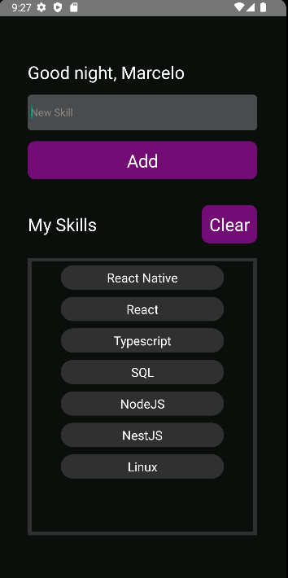

# My Skills - React Native

Used this tech:

<li>React Native</li>
<li>Typescript</li>

# Resume

This is a simple app in react native with two pages:

<li>Home</li>
<li>My Skills</li>
 

In Home we could put owr name and in My Skills we store de skills we have

This is a Home picture. Where input the name and send

This is a My Skills picture. Where we add the skills we have. If touch in skill, her will be excluded. In the Clear Button will clean all skills

